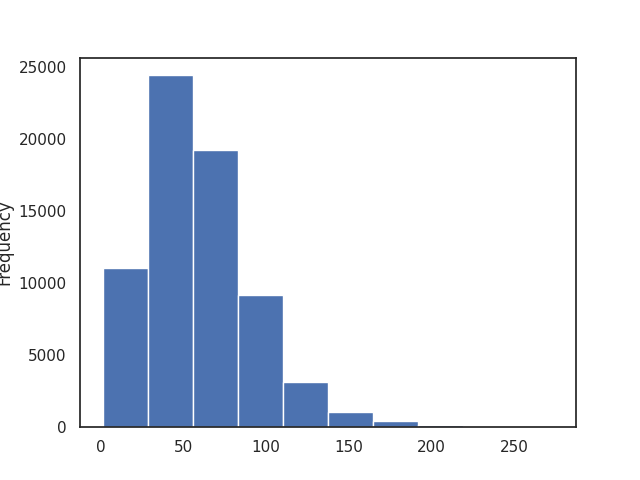
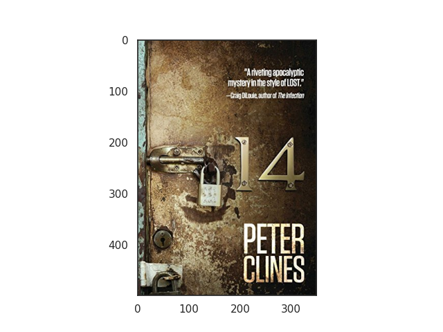

# (전북대학교 SW중심대학사업단) 2023년 인공지능 온라인 경진대회

책 커버(이미지와 제목) 정보가 주어질 때, 책의 장르를 분류하는 문제를 해결

최종 순위: [**2** / 35]

## 핵심 아이디어

위는 책 제목의 길이를 나타낸 히스토그램인데 매우 짧은 길이의 제목도 존재함을 알 수 있다.

이 책의 제목은 `14`인데 이것만 알아서는 해당 책의 장르가 미스테리라는 것을 알 수 없다. 하지만 책 표지를 보면 `mystery`라는 단어가 적힌 것을 알 수 있다. 이를 바탕으로 책 표지에서 텍스트를 추출하여 추가 데이터로 사용함으로써 모델의 성능을 향상시킬 수 있었다.
